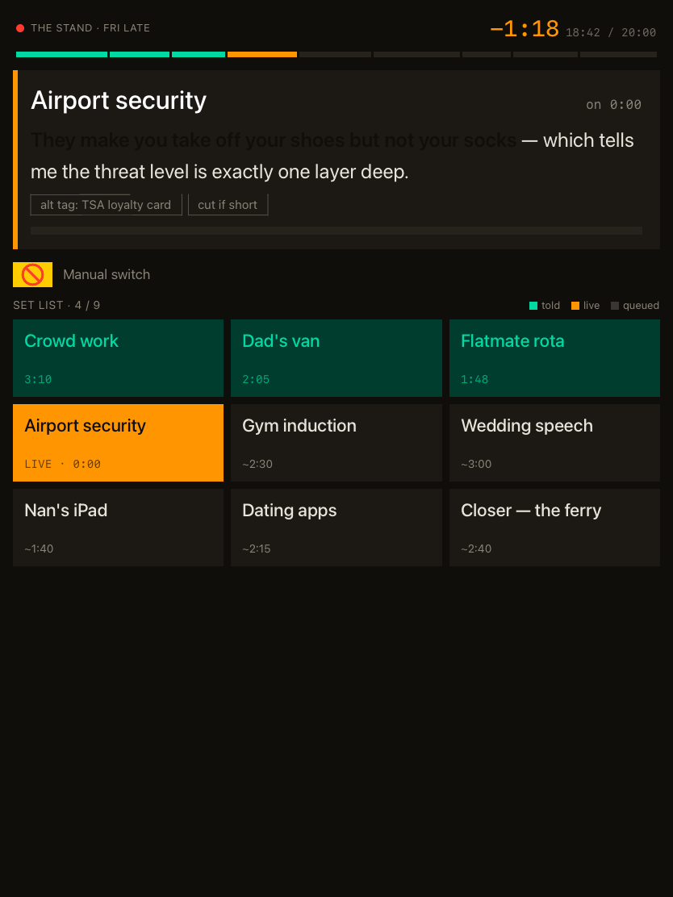
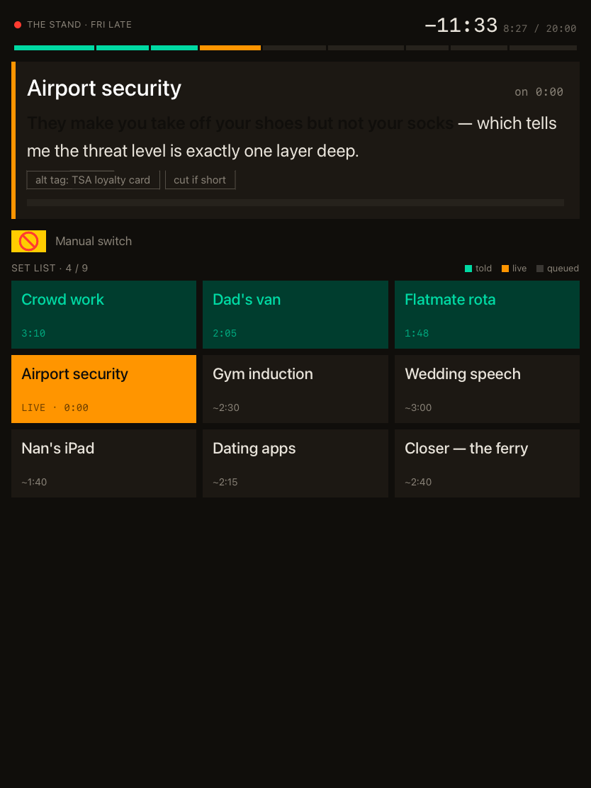
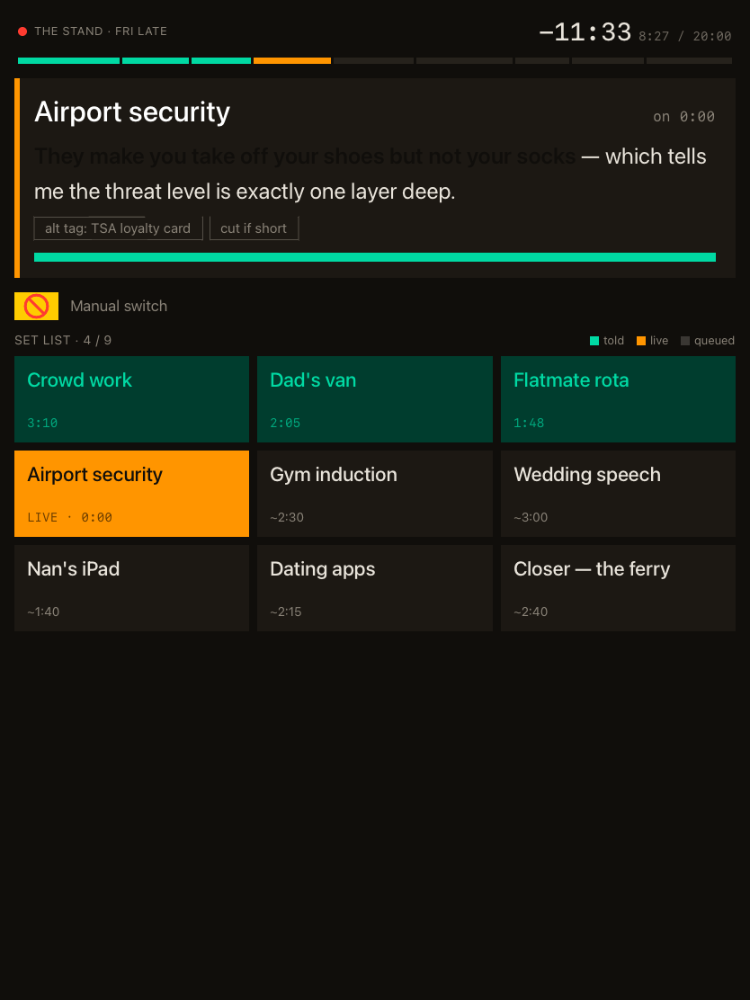

# Set list — executable requirements

The numbered spec for the Set list iPad app. Every leaf below is claimed by
exactly one executable case under this directory, or is listed in
[`gate/pending.json`](gate/pending.json) as a deliberate, tracked gap. The
coverage gate ([`gate/coverage-gate.mjs`](gate/coverage-gate.mjs)) enforces
that bijection, so a leaf added here is red until something proves it.

Scope is **Phase A** — the client-only MVP defined in
[`../design/architecture.md`](../design/architecture.md), seeded from the
owner's screen-level requirements in
[`../design/setlist-requirements.md`](../design/setlist-requirements.md) and
the mockups in
[`../design/mockups/setlist-ipad-mockups.html`](../design/mockups/setlist-ipad-mockups.html).
Phase B (backend pipeline, QR share) and Phase C (cross-show analysis,
autodetect) add their own sections when they are built.

> **Harness gap — read before trusting a green run.** The Swift lanes run only
> in CI: this project's agent sessions run on Linux with no Swift toolchain and
> no macOS, so `swift test` and any simulator-rendered golden are verified by
> the CI job, never locally. A leaf marked **⚠ TBD** is in
> `gate/pending.json`: it is specified but nothing executes it yet. That list is
> a burn-down list, tracked by #6, and it only shrinks.

---

## 1 — Material library

The durable material: jokes, the sets built from them, the shows they are
performed at.

- `1.1` A joke carries a title, body text, delivery notes, tags, callback references and an estimated length.
- `1.2` Crucial-setup spans marked inside a joke's body survive an encode/decode round-trip with their character offsets intact.
- `1.3` A set is an ordered list of jokes; reordering changes positions only, never joke identity.
- `1.4` A set's planned length is the sum of its jokes' estimated lengths.
- `1.5` A show carries venue, start time, planned set length and structured audience descriptors — size, seating, service, time-of-day and crowd type, each independently unknown.
  

Why structured, not freeform

  The owner's open proposal in `setlist-requirements.md` asks for freeform vs.
  structured. Structured is the one that answers "underperforms with seated
  dinner crowds", which is the analysis product's whole point. Each descriptor
  is independently optional: an unset descriptor is absent, never a zero or an
  empty string, so "80 seated" and "unknown size, seated" stay distinguishable.
  

- `1.6` The library survives app relaunch: jokes, sets and shows written in one session are read back in the next.

## 2 — Stage mode, rendered state

The live screen, portrait, as drawn in mockup 1. Every leaf here is a resting
state an owner checks by sight.

- `2.1` The stage screen fills one portrait iPad screen at 3:4 with no scrolling region.
<!-- gallery:2.1 --> 
- `2.2` The current joke occupies the top region, its body text the largest text on the screen.
<!-- gallery:2.2 --> 
- `2.3` Crucial setups render highlighted inside the current joke's body.
<!-- gallery:2.3 --> 
- `2.4` The current joke's optional text — alternate tags, callbacks, delivery notes — renders below the body as tags, callbacks distinguished from plain tags.
<!-- gallery:2.4 --> 
- `2.5` The set list renders as a 3-column grid of nine cards, each card carrying its joke's title.
<!-- gallery:2.5 --> 
- `2.6` Told, live and queued cards are each coloured differently, with a key naming the three states.
<!-- gallery:2.6 --> 
- `2.7` No stage-mode card carries a laugh count or laugh score.
  

Owner requirement, asserted as a rule not a picture

  "No per-bit laugh count on this screen" is an absence, and an absence is
  exactly what a snapshot proves badly — a golden that happens not to show a
  number today keeps passing when one is added tomorrow in a state the golden
  does not cover. The rule is asserted against the stage view model instead:
  no card field carries laugh data.
  

- `2.8` The countdown is subordinate to the joke text and shows remaining time, elapsed time and the set's planned length.
<!-- gallery:2.8 --> 
- `2.9` The countdown's colour is neutral while more than three minutes remain, orange at three minutes or less, red once remaining time reaches zero, after which it counts up as a negative.
- `2.10` The pacing bar carries one segment per joke in set order, sized by estimated length, marked told, live or queued.
<!-- gallery:2.10 --> 
- `2.11` A recording indicator is visible in the header whenever capture is running.
<!-- gallery:2.11 --> 
- `2.12` ⚠ TBD The segment-mode control is a standard iOS switch labelled "Manual switch" when off and "Autodetect bits" when on, with no explanatory text beside it.
  

Why a golden cannot see this one

  The standard switch is UIKit-backed, and the renderer behind the screen kind
  refuses to flatten it — it logs "Unable to render flattened version of
  PlatformViewRepresentableAdaptor&lt;Switch&gt;" and leaves the control out of
  the image. Drawing a lookalike in pure SwiftUI would make the golden pass
  while breaking the requirement, so this leaf waits for a kind that drives the
  real control instead.
  

- `2.13` The segment-mode switch cannot be turned on while no autodetector is available, and reports itself unavailable rather than silently ignoring the gesture.
  

Phase A has no autodetector

  Autodetect is Phase B/C work (`architecture.md`, Phase A: "Autodetect is
  explicitly out of Phase A"). Shipping the switch live-but-inert would lie on
  stage, which is the one place a lie costs a set. The availability is a
  property of the stage model, so the switch becomes real the moment a detector
  registers, with no view change.
  

- `2.14` A laugh strip runs under the current joke, lit while the live laugh level is above the speak-over threshold and dim below it.
<!-- gallery:2.14 --> 

## 3 — Stage mode, driven

What card taps do. Manual segmentation is Phase A's only segmentation.

- `3.1` Tapping a queued card ends the live joke's segment and opens a segment for the tapped joke at the same instant.
- `3.2` Tapping the live card changes nothing and opens no zero-length segment.
- `3.3` Tapping a told card re-opens it as live and opens a second segment for it, leaving its first segment intact.
- `3.4` Card taps are stamped on the capture clock, so a tap's timestamp is comparable with a laugh event's without conversion.
- `3.5` The set-list header counts jokes started out of jokes planned, counting a re-opened joke once.
- `3.6` Every segment opened by a card tap records `manual` provenance.

## 4 — Capture

The recording session. One module owns the microphone.

- `4.1` Recording starts when the show starts and runs unbroken to the end of the set.
  

What the capture proofs actually confirm

  4.1, 4.2 and 4.6 drive a fake recording session that records what the app
  asked it to do. They confirm this code *asks* for a recording of the right
  shape at the right moments — not that AVAudioEngine delivers one. The part no
  fake can stand in for is 4.5, recording through a locked screen, which stays a
  tracked gap until it is measured on a real iPad.
  

- `4.2` The recording is written as AAC into the app's own container, in a location the user can delete.
- `4.3` A laugh event carries its class, confidence, start, duration, intensity and the identifier of the detector that produced it.
  

Detector identity is not optional

  Decision D3: on-device SoundAnalysis and the Phase B batch detector produce
  scores that are not comparable until a calibration pass exists. An event that
  cannot say which detector produced it silently poisons cross-show analysis,
  so the field is required at construction, not defaulted.
  

- `4.4` Laugh events and card taps are ordered on one monotonic clock, so their interleaving is well defined even across a wall-clock change.
- `4.5` ⚠ TBD Recording continues while the iPad is locked and the app is backgrounded.
- `4.6` An audio-session interruption finalises the recording so far and resumes into the same show without losing captured audio.

## 5 — Review

Post-show, and across shows. Phase A has no transcript, so nothing here
depends on one.

- `5.1` ⚠ TBD A show's review screen lists its bits in performed order with each bit's laugh events aligned to it.
- `5.2` ⚠ TBD The show chain renders one bar per bit, cold bits coloured apart from the rest.
- `5.3` ⚠ TBD Takes of one joke render side by side, each with its show, date, audience line and laugh trace, aligned on segment start.
- `5.4` A take is flagged anomalous when its peak laugh duration falls at least two standard deviations below the mean of the joke's other takes, and never when fewer than three other takes exist.
- `5.5` ⚠ TBD Transcript-dependent affordances are hidden while the show has no transcript.

## 6 — Consent, privacy, compliance

App Review guideline 2.5.14 and the "stays on your iPad" promise.

- `6.1` ⚠ TBD The consent screen is shown, and consent recorded, before the app first requests microphone access.
- `6.2` ⚠ TBD A recording indicator is visible on every screen that can be shown while capture is running.
- `6.3` ⚠ TBD The consent screen carries the line telling the comedian to observe local law and venue rules on recording an audience.
- `6.4` The app declares a microphone usage description and the background-audio mode, and declares no other background mode.
- `6.5` ⚠ TBD Phase A makes no outbound network request carrying recording, joke or show data.
