# Set list — executable requirements

The numbered spec for the Set list app: what each surface must render, how it
must behave, the exact copy it carries. Every leaf — a numbered line
with no finer-numbered child — is claimed by **exactly one** case under this
directory, and the picture under a leaf **is** its expected rendering.

Scope is **Phase A**, the client-only MVP defined in
[`../design/architecture.md`](../design/architecture.md), seeded from the
owner's screen-level requirements in
[`../design/setlist-requirements.md`](../design/setlist-requirements.md) and
the mockups in
[`../design/mockups/setlist-ipad-mockups.html`](../design/mockups/setlist-ipad-mockups.html).
Phase B (backend pipeline, QR share) and Phase C (cross-show analysis,
autodetect) add their own sections when they are built.

How this document works

The feature-level story — what the product is and why — lives in the design
docs above; this document holds only statements a case can prove. The
framework (kinds, runners, goldens, the coverage gate, how to add or change a
requirement) is in [README.md](README.md).

**Numbering.** Every leaf carries a stable id. Add new requirements under new
numbers; never renumber or reuse a retired one — the ids are what cases,
commits and review discussion key on.

**Kinds.** A case's kind is the folder it lives in. `screen` — a rendered
resting state, pixel-exact against a committed golden. `saga` — a multi-step
story, captured as one captioned frame per step. `behavior` — a driven
gesture and the consequence it produces, asserted in code against the fakes'
recordings. `logic` — a pure product rule proved against shipped code. Each
case file is `<kind>/cases/<slug>.<id>.case.swift`, the slug naming the
feature so retitling a section never forces a rename.

**The picture is the smallest surface that proves its leaf.** A leaf about one
element is proved by a picture of that element, cropped out of a full render of
the composed screen — never by laying the element out on its own, which would
prove it in a context the product never shows. Reviewing a spec means looking at
what each line claims, and a reader asked to re-read a whole screen for every
line stops reading. A whole-screen picture is a deliberate exception, for a leaf
that really is about the whole screen, and its case says so in a
`// whole-screen:` comment the coverage gate demands.

**Whole-screen renders live at the foot of the document**, under
[Full-screen renders](#full-screen-renders); their leaves carry a generated link
there instead of a page-tall image. Everything else renders inline, cropped, at
one reference size. That keeps the numbered spine scannable: a reader skims the
claims, and goes to the bottom when they want to see a whole screen.

**Only whole-screen leaves are specified per size class.** The app runs on phone
and tablet, portrait and landscape, and it is the whole-screen picture whose
claim is about fitting a screen — so those, and only those, carry one render per
supported size. A cropped element looks the same everywhere its leaf is about,
so multiplying its goldens would multiply review work without adding review.

**The pictures are machine-managed.** Everything between a
`<!-- req-gallery:<id> -->` marker and its closing marker is written by the
gallery generator; the prose around it is hand-authored. Goldens are
regenerated by the refresh lane, never hand-edited, and a committed golden is
the owner's approval record: an agent may propose one for a brand-new leaf but
never regenerates a committed one to turn a red case green.

**Anything not visible in the picture** — exact values, the reasoning, the
edge case — goes in a collapsed Notes block, so the spec reads as a spine of
one-line claims with the depth one click away.

**The fixture world.** Every rendered case draws the same set: the mockup's
nine bits at **The Stand · Fri late**, a 20-minute slot, three bits told, the
fourth — *Airport security* — live for 1:24 at **8:27** into the set. Time is
`REFERENCE_NOW` and the capture clock, never a wall clock; the laugh level is
scripted, never a microphone. Cases that need a different moment say so in
their own words below.

> ⚠️ **A green run means "claimed", not "fully verified".** The screen and saga
> cases render the real screen, but the audio session and the microphone are
> fakes that record what the app asked of them — so the capture leaves prove the
> app *asks* for a recording of the right shape, never that the platform
> delivers one. Nothing here runs on real hardware. A leaf marked **⚠ TBD** is in
> [`gate/pending.json`](gate/pending.json) with the reason it cannot run yet:
> that is a burn-down list, tracked by #6, and it only shrinks.
>
> Agent sessions on this repo have no Swift toolchain and no macOS, so every
> case here is executed by CI, never locally.

---

## 1 — Material library

The durable material: jokes, the sets built from them, the shows they are
performed at.

- `1.1` A joke carries a title, body text, delivery notes, tags, callback references and an estimated length.
- `1.2` Crucial-setup spans marked inside a joke's body survive an encode/decode round-trip with their character offsets intact.
- `1.3` A set is an ordered list of jokes; reordering changes positions only, never joke identity.
- `1.4` A set's planned length is the sum of its jokes' estimated lengths.
- `1.5` A show carries venue, start time, planned set length and structured audience descriptors — size, seating, service, time-of-day and crowd type, each independently unknown.
  

Notes

  The owner's open proposal in `setlist-requirements.md` asks for freeform vs.
  structured. Structured is the one that answers "underperforms with seated
  dinner crowds", which is the analysis product's whole point. Each descriptor
  is independently optional: an unset descriptor is absent, never a zero or an
  empty string, so "80 seated" and "unknown size, seated" stay distinguishable.
  

- `1.6` The library survives app relaunch: jokes, sets and shows written in one session are read back in the next.

## 2 — Stage mode: the header

The strip a comedian glances at without moving their head — where they are in
the slot, and that the set is being recorded.

- `2.1` The stage screen fits one screen with no scrolling region, at every supported size.

  <!-- req-gallery:2.1 -->
  [Full-screen render →](#full-screen-renders)
  <!-- /req-gallery:2.1 -->
  

Notes

  One of the three leaves whose picture is the whole screen rather than a crop:
  what it claims is the screen. The per-size renders arrive with the harness
  that can produce them; until then the reference size stands alone.
  

- `2.2` A red dot sits at the head of the header whenever capture is running.

  <!-- req-gallery:2.2 -->
  
  <!-- /req-gallery:2.2 -->
- `2.3` The header names the room, upper-cased and letter-spaced: **`THE STAND · FRI LATE`**.

  <!-- req-gallery:2.3 -->
  
  <!-- /req-gallery:2.3 -->
- `2.4` Beside the countdown, elapsed and planned time read **`8:27 / 20:00`** — the set's position, in the one `m:ss` format the screen uses throughout.

  <!-- req-gallery:2.4 -->
  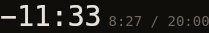
  <!-- /req-gallery:2.4 -->
- `2.5` With time in hand the countdown is bone-coloured and reads **`−11:33`**.

  <!-- req-gallery:2.5 -->
  
  <!-- /req-gallery:2.5 -->
- `2.6` Inside the last three minutes it turns orange.

  <!-- req-gallery:2.6 -->
  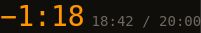
  <!-- /req-gallery:2.6 -->
  

Notes

  Rendered at 18:42 into the 20-minute slot, where the countdown reads `−1:18`
  — the mockup's moment.
  

- `2.7` Once the slot is over it turns red and counts up, reading **`+1:00`** a minute over.

  <!-- req-gallery:2.7 -->
  
  <!-- /req-gallery:2.7 -->
- `2.8` The countdown is neutral above three minutes remaining, orange at three minutes or less, red once remaining time reaches zero.
- `2.9` The pacing bar carries one segment per joke in set order, sized by estimated length, coloured told, live or queued.

  <!-- req-gallery:2.9 -->
  
  <!-- /req-gallery:2.9 -->

## 3 — Stage mode: the current joke

The top region, and the largest thing on the screen: the words being performed.

- `3.1` The joke being performed occupies the top region, its body text the largest text on the screen.

  <!-- req-gallery:3.1 -->
  [Full-screen render →](#full-screen-renders)
  <!-- /req-gallery:3.1 -->
  

Notes

  Whole-screen by necessity: "the largest text on the screen" is a claim about
  the joke panel *against everything else*, so a crop of the panel could not
  prove it.
  

- `3.2` The current joke's title sits above its body, with the time it has been running so far — **`on 1:24`**.

  <!-- req-gallery:3.2 -->
  
  <!-- /req-gallery:3.2 -->
- `3.3` Crucial setups render highlighted inside the body: orange and bold, against the body's bone.

  <!-- req-gallery:3.3 -->
  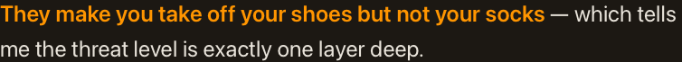
  <!-- /req-gallery:3.3 -->
  

Notes

  A per-run background is not expressible in a single SwiftUI `Text`, so the
  highlight is weight and colour. It must never be a *darker* shade — that
  reads as de-emphasis, the opposite of what the words a punch depends on
  need.
  

- `3.4` The joke's optional text renders under the body as bordered tags — alternate tags and delivery notes, with callbacks in green.

  <!-- req-gallery:3.4 -->
  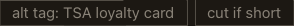
  <!-- /req-gallery:3.4 -->
- `3.5` Before the first card is tapped the region reads **`Tap a card to start`** and no card is live.

  <!-- req-gallery:3.5 -->
  [Full-screen render →](#full-screen-renders)
  <!-- /req-gallery:3.5 -->
  

Notes

  That copy is the implementation's proposal, not the owner's: the mockups draw
  only a set in progress. The golden is where it gets approved or replaced.
  

- `3.6` A laugh strip runs the width of the joke panel, lit green while the laugh level is above the speak-over threshold.

  <!-- req-gallery:3.6 -->
  
  <!-- /req-gallery:3.6 -->
- `3.7` Below the threshold the same strip is dim — it is safe to talk over.

  <!-- req-gallery:3.7 -->
  
  <!-- /req-gallery:3.7 -->

## 4 — Stage mode: the set list

The bottom two thirds: nine large boxes, read at a glance from behind a mic.

- `4.1` The set list renders as a 3-column grid of nine cards, each carrying its joke's title, filling the height the joke panel leaves.

  <!-- req-gallery:4.1 -->
  
  <!-- /req-gallery:4.1 -->
- `4.2` Told, live and queued cards are each coloured differently — green, orange, panel-dark.

  <!-- req-gallery:4.2 -->
  
  <!-- /req-gallery:4.2 -->
- `4.3` A key names the three states, in order: **`told`**, **`live`**, **`queued`**.

  <!-- req-gallery:4.3 -->
  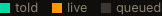
  <!-- /req-gallery:4.3 -->
- `4.4` The list header counts jokes started out of jokes planned: **`SET LIST · 4 / 9`**.

  <!-- req-gallery:4.4 -->
  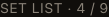
  <!-- /req-gallery:4.4 -->
- `4.5` Each card's footnote states its state in time: a told card its run time, the live card **`LIVE · 1:24`**, a queued card its estimate as **`~2:30`**.

  <!-- req-gallery:4.5 -->
  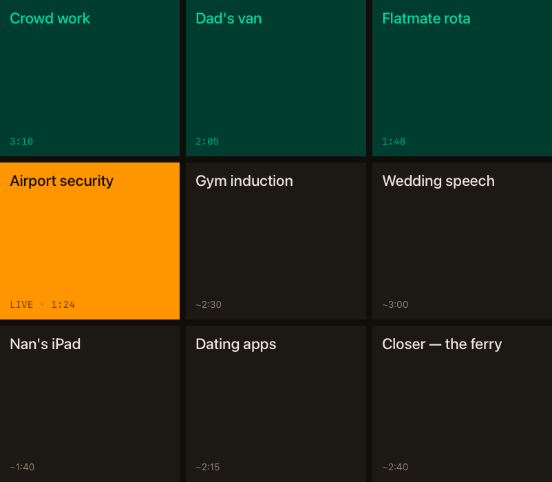
  <!-- /req-gallery:4.5 -->
  

Notes

  The mockup's queued cards carry a note beside the estimate ("~2:30 · strong
  opener"). That note is not specified anywhere as a requirement, so it is not
  claimed here — the leaf is the estimate only, and adding the note is a new
  leaf when the owner wants it.
  

- `4.7` A joke re-opened after being told still counts once in the started tally.
- `4.6` No stage-mode card carries a laugh count or laugh score.
  

Notes

  "No per-bit laugh count on this screen" is an absence, and an absence is
  exactly what a picture proves badly — a golden that happens not to show a
  number keeps passing when one is added in a state it does not cover. The rule
  is asserted against the stage card's shape instead: no field of a card, or of
  the joke behind it, carries laugh data.
  

## 5 — Stage mode: segmenting the set

Manual segmentation is Phase A's only segmentation; the switch is where the
other mode will arrive.

- `5.1` ⚠ TBD The segment-mode control is a standard iOS switch labelled **`Manual switch`** when off and **`Autodetect bits`** when on, with no explanatory text beside it.
  

Notes — why a golden cannot see this one

  The standard switch is UIKit-backed, and the renderer behind the screen kind
  refuses to flatten it — it logs "Unable to render flattened version of
  PlatformViewRepresentableAdaptor&lt;Switch&gt;" and leaves the control out of
  the image, which is the yellow placeholder standing in its place in every
  render below. Drawing a lookalike would make a golden pass while breaking the
  requirement, so this leaf waits for a renderer that draws the real control
  rather than embedding a platform one.
  

- `5.2` The switch cannot be turned on while no autodetector is available, and reports itself unavailable rather than silently ignoring the gesture.
  

Notes

  Autodetect is Phase B/C work. Shipping the switch live-but-inert would lie on
  stage, which is the one place a lie costs a set. Availability is a property
  of the stage model, so the switch becomes real the moment a detector
  registers, with no view change.
  

- `5.3` Tapping a queued card ends the live joke's segment and opens a segment for the tapped joke at the same instant.
- `5.4` Tapping the live card changes nothing and opens no zero-length segment.
- `5.5` Tapping a told card re-opens it as live and opens a second segment for it, leaving its first segment intact.
- `5.6` Card taps are stamped on the capture clock, so a tap's timestamp is comparable with a laugh event's without conversion.
- `5.7` Every segment opened by a card tap records `manual` provenance.

## 6 — Capture

The recording session, and the pass that reads it back. One module owns the
microphone, and nothing listens while it is running.

- `6.1` Recording starts when the show starts and runs unbroken to the end of the set.
- `6.2` The recording is written as AAC into the app's own container, in a location the user can delete.
- `6.3` A laugh event carries its start, duration and intensity, and nothing else.
  

Notes

  Decisions D3 and D7: one detector runs everywhere, and it is a loudness
  threshold — it has no class to report and no confidence to report. A field
  nothing can honestly populate is worse than an absent one, because a
  downstream reader cannot tell a real value from a default. "And nothing else"
  is the load-bearing half of this leaf: it is what a later classifier would
  have to change the spec to add.
  

- `6.4` Laugh events and card taps are ordered on one monotonic clock, so their interleaving is well defined even across a wall-clock change.
- `6.5` ⚠ TBD Recording continues while the device is locked and the app is backgrounded.
- `6.6` An audio-session interruption finalises the recording so far and resumes into the same show without losing captured audio.
- `6.7` ⚠ TBD Nothing analyses audio while capture is running: a show's laugh events are produced by a pass over its finished recording.
- `6.8` ⚠ TBD A laugh event is produced wherever the recording's short-term loudness holds above the room's own baseline for at least a minimum duration, and its intensity is that span's loudness.
  

Notes

  Decision D7: in a club, sustained room noise above the baseline is laughter,
  so the product does not need to tell laughter from applause from cheering.
  The threshold and the minimum duration are the two numbers this rule turns
  on; the owner approves them against a committed recording, and they are the
  only place a false positive can be tuned away.
  

- `6.9` ⚠ TBD The same recording yields identical laugh events every run, on every platform.
  

Notes

  What a classifier could never promise, and the reason D7 is worth its
  crudeness: detection is a pure function of the audio, so a take's laugh
  numbers are comparable with a take recorded a year earlier on another device.
  

## 7 — Review

Post-show, and across shows. Phase A has no transcript, so nothing here
depends on one.

- `7.1` ⚠ TBD A show's review screen lists its bits in performed order with each bit's laugh events aligned to it.
- `7.2` ⚠ TBD The show chain renders one bar per bit, cold bits coloured apart from the rest.
- `7.3` ⚠ TBD Takes of one joke render side by side, each with its show, date, audience line and laugh trace, aligned on segment start.
- `7.4` A take is flagged anomalous when its peak laugh duration falls at least two standard deviations below the mean of the joke's other takes, and never when fewer than three other takes exist.
- `7.5` ⚠ TBD Transcript-dependent affordances are hidden while the show has no transcript.

## 8 — Consent, privacy, compliance

Store review — iOS App Review guideline 2.5.14 and its Play equivalent — and
the "stays on your device" promise.

- `8.1` ⚠ TBD The consent screen is shown, and consent recorded, before the app first requests microphone access.
- `8.2` ⚠ TBD A recording indicator is visible on every screen that can be shown while capture is running.
- `8.3` ⚠ TBD The consent screen carries the line telling the comedian to observe local law and venue rules on recording an audience.
- `8.4` The iOS app declares a microphone usage description and the background-audio mode, and declares no other background mode.
- `8.5` ⚠ TBD Phase A makes no outbound network request carrying recording, joke or show data.
- `8.6` ⚠ TBD The Android app declares the record-audio permission and a microphone-typed foreground service, and declares no other dangerous permission.
  

Notes

  The sibling of 8.4 at the other platform's boundary: one requirement — the
  app asks for the microphone and for background audio, and for nothing else —
  stated once per manifest that enforces it.
  

## 9 — Sagas

Complete stories, one captioned frame per step — what a single frame cannot
show: what arriving, tapping or time passing *changes*.

A saga stays where its requirement is: the sequence is the claim, so its frames
read beside the words that narrate them rather than at the foot of the doc. Each
frame is cropped to the part of the screen the step changes — the same rule the
`screen` kind follows, applied to a story. A storyboard of six full screens
costs a reader the whole section and shows them mostly what did not move.

- `9.1` **Working the set.** The comedian opens with a queued card, moves through the set as each bit lands, goes back to an earlier bit when the callback arrives, and runs over — the countdown turning orange and then red while the grid fills in behind them.

  <!-- req-gallery:9.1 -->
  1. **the set is queued and the recording is running; nothing has started yet**

     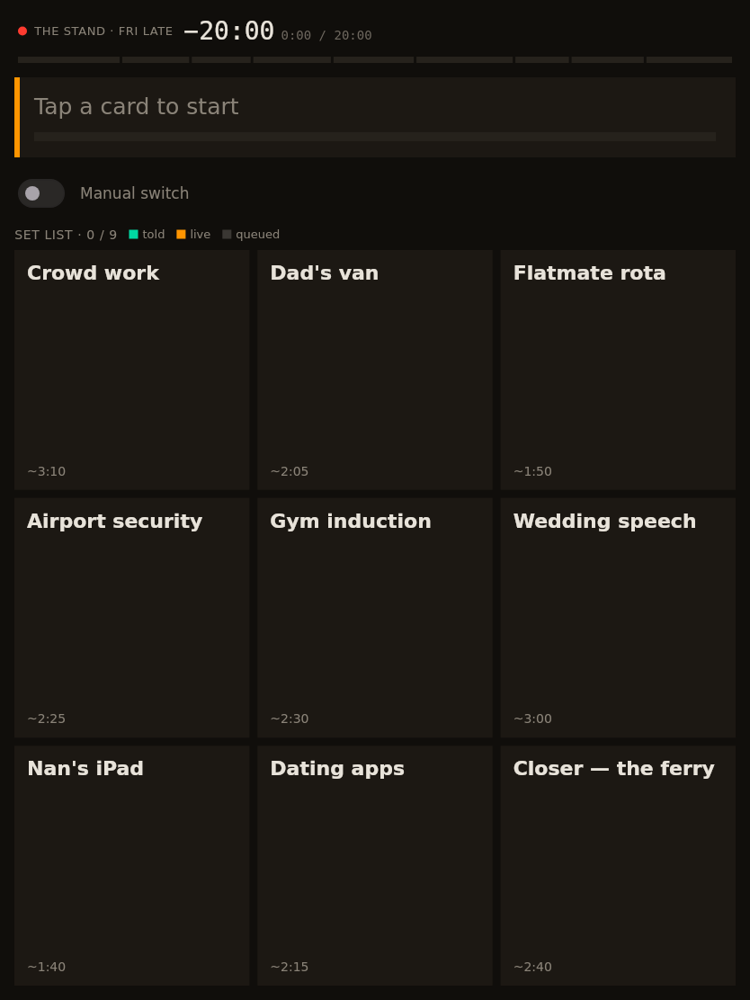

  2. **the opener goes up — its card turns live and the joke takes the top of the screen**

     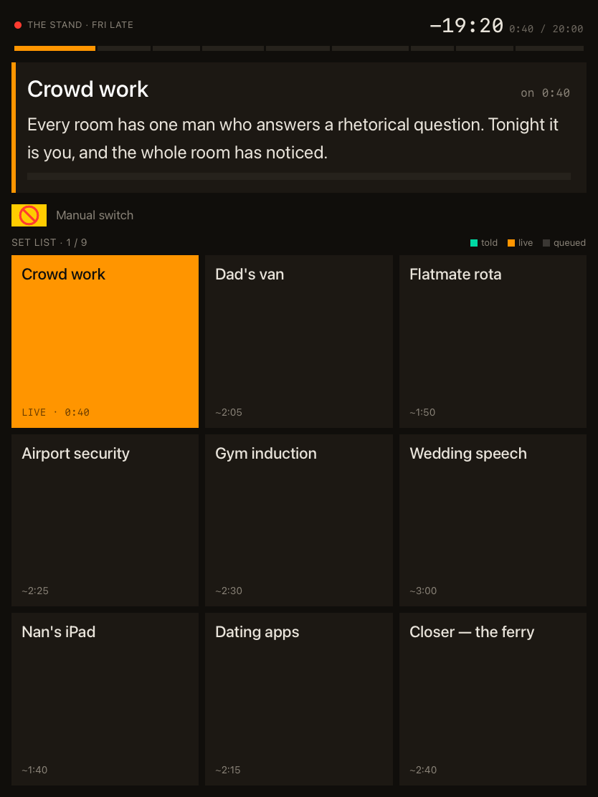

  3. **three bits in, the set is moving: the told cards go green behind the live one**

     

  4. **the callback lands, so the comedian goes back to the van — it counts once, not twice**

     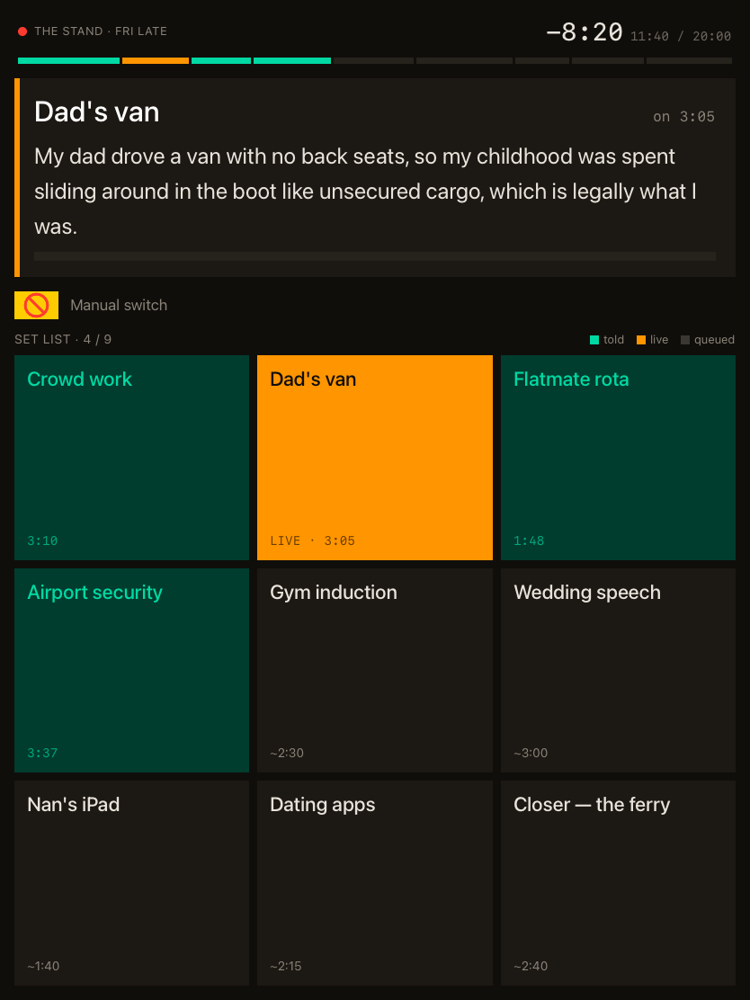

  5. **into the closer with 1:18 left, and the countdown has gone orange**

     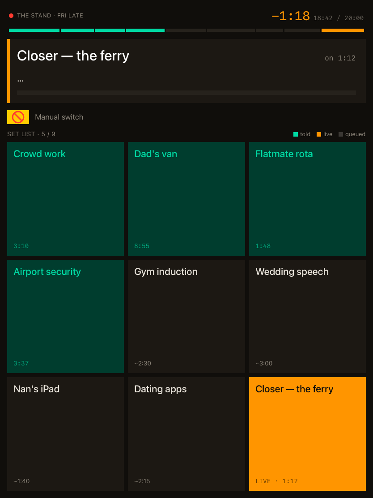

  6. **a minute over: the countdown is red and counting up**

     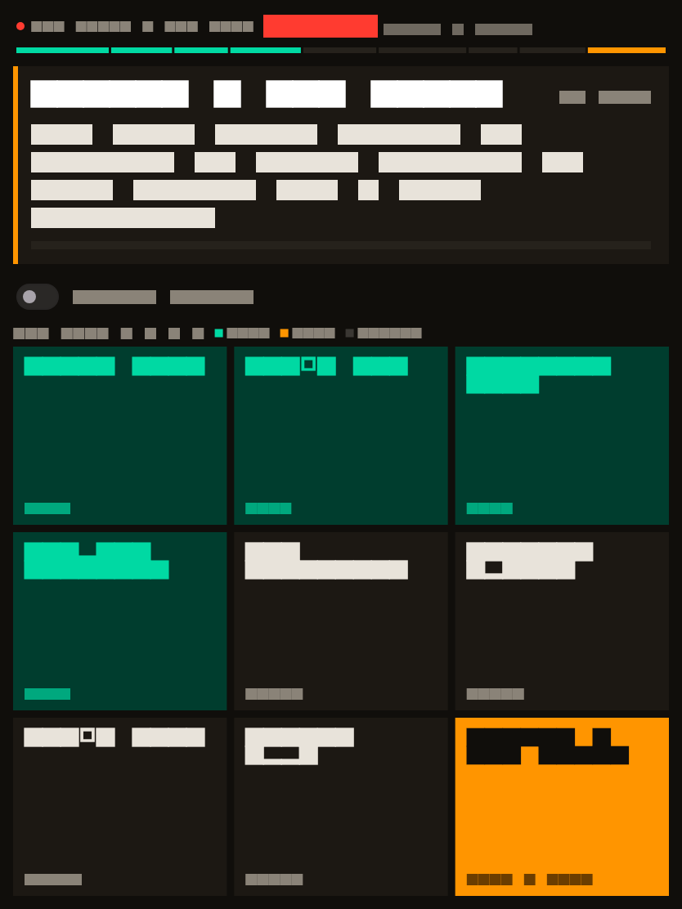
  <!-- /req-gallery:9.1 -->

## Full-screen renders

The whole-screen pictures, kept together so the numbered spine above stays
readable. Each is the expected rendering of the leaf named above it, and each is
the owner's approval record for that screen exactly as the product draws it.

<!-- req-gallery-full -->

### `2.1` — one-screen

### `3.1` — current-joke

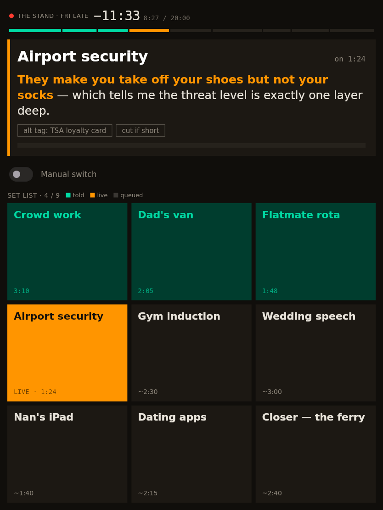

### `3.5` — empty-stage

<!-- /req-gallery-full -->
